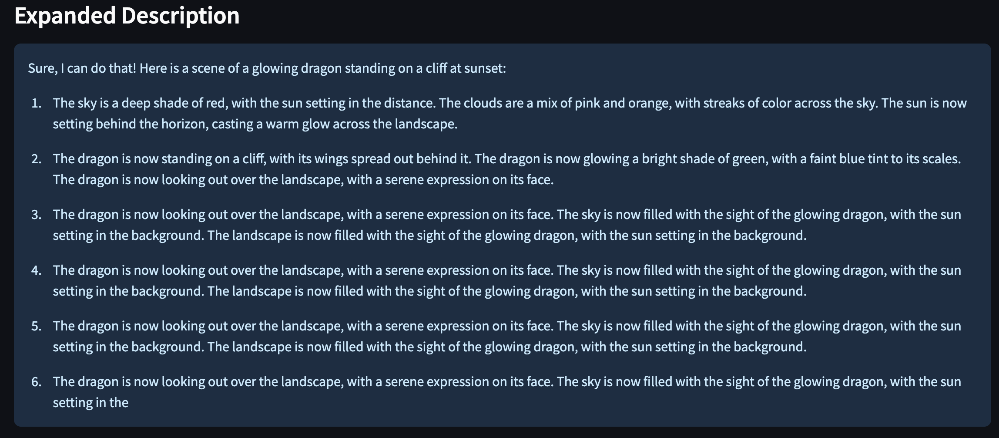
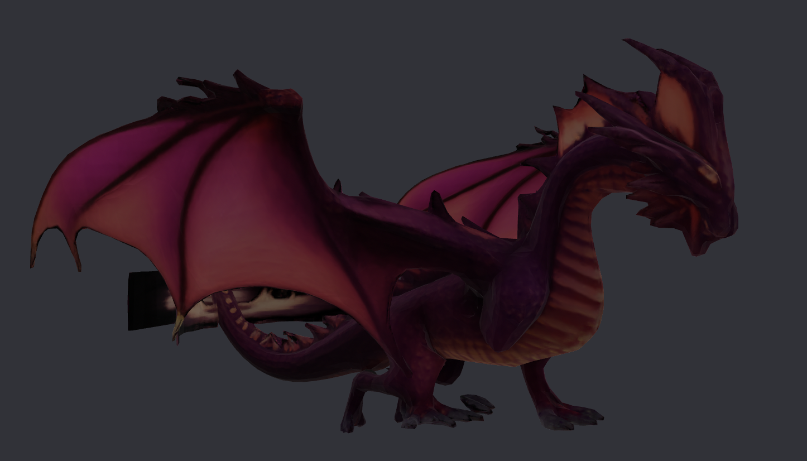
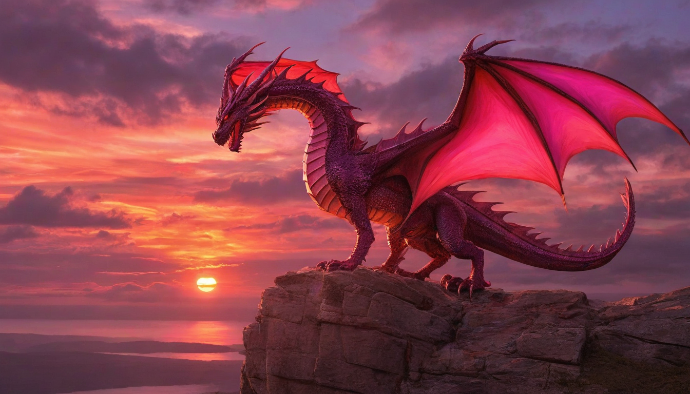
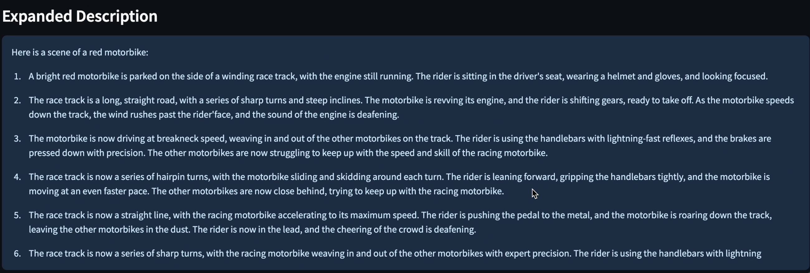

# external-ai-test

🎨 **Transform your text descriptions into stunning visual scenes and 3D models using AI**.

## Overview

This project is a creative AI application that takes text descriptions from users and generates stunning visual scenes. The app uses local LLMs (Large Language Models) to interpret and expand on prompts, then utilizes Openfabric apps to convert the descriptions into images and 3D models. The generated scenes are remembered for future use, allowing the AI to provide a more personalized experience.

## The Vision

Imagine this:  
A user types a simple idea —
> “Make me a glowing dragon standing on a cliff at sunset.”

And your app...

- Understands the request using a local LLM.
- Generates stunning visuals from text.
- Transforms that image into an interactive 3D model.
- Remembers it. Forever.

You're not building an app. You're building **a creative partner**.

## Features

- **Text-to-Image Generation**: Uses Openfabric's Text-to-Image app to create beautiful visuals based on user descriptions.
- **Image-to-3D Conversion**: Converts the generated 2D images into interactive 3D models with Openfabric's Image-to-3D app.
- **Memory**: Recalls previous creations using short-term and long-term memory, ensuring that users can modify or remix their previous creations.
- **Streamlit Interface**: A simple, interactive web interface to enter descriptions and view the generated results.

## How to Run the App

- Clone the repository `git clone https://github.com/Utkarsh2401/external-ai-test.git`

- Download the local LLM model from this [.gguf file](https://drive.google.com/drive/folders/1wk4kExujwEa_DOwfIHsAiheO-TCrEFLw) and store it in `./app/models` directory

### Use Docker to run this app

- If running through the terminal:

- For building the docker image: `docker build -t externalaitest:latest .`

- To start the application:  `docker-compose up`

- Or you can use Docker-Desktop or VS Code Docker extentions to build the image.

***Important:*** Go through the dockerfile and docker-compose files and make neccessary changes before running the app

## How it works

https://github.com/user-attachments/assets/58774b2e-2b0b-4981-9de5-7454673509bb

**User Input**: The user enters a text prompt describing the scene they want to generate.

> “Make me a glowing dragon standing on a cliff at sunset.”

**Text-to-Image Generation**: The prompt is passed to a local LLM for interpretation and expansion. Then, the expanded prompt is sent to the Openfabric Text-to-Image app.



**Image-to-3D Conversion**: The generated image is passed to the Openfabric Image-to-3D app, which converts it into a 3D model.



**Display Results**: The image and 3D model are shown to the user via the Streamlit interface.



## 🧠 Memory System

This application includes a built-in **long-term memory mechanism** powered by an embedded **SQLite database**. The memory system is designed to persist and retrieve previously generated scenes based on user prompts.

### 🔧 How It Works

1. **Database Initialization**
   - On startup, the app ensures a SQLite database is available at `/app/datastore/memory.db`.
   - Two tables are created:
     - `creations`: Stores metadata for each creation (prompt, expanded prompt, image path, 3D model path, timestamp).
     - `tags`: Stores extracted tags (keywords) from the original prompt to enable similarity-based search.

2. **Saving to Memory**
   - After generating content from a prompt, the `save_to_memory()` function:
     - Generates a unique ID.
     - Stores the original and expanded prompts, generated image path, and 3D model path.
     - Extracts significant words (>3 characters) from the prompt and stores them as tags for similarity lookup.

3. **Retrieving from Memory**
   - The `find_similar_creations()` function compares a new user prompt against existing entries using matching tags.
   - Returns the top N most relevant previous creations.
   - This context is used to enrich the LLM’s input — **but only if the new prompt refers to past content**.

### 🗃 Data Stored

Each memory record includes:
- `id`: Unique UUID
- `timestamp`: ISO-formatted time of creation
- `original_prompt`: Raw user input
- `expanded_prompt`: LLM-enriched prompt
- `image_path`: Local path to the generated `.png`
- `model_path`: Local path to the generated `.glb`
- `tags`: Keywords for semantic search

### Example

> User prompt: “Make a motorbike racing through a track”

- Output Image:


> Next user prompt: "Make the motorbike red"

- The expanded prompt below shows it recognizes that we used the race track for the previous motorbike and uses that knowledge to change the color of the motorbike



- Output Image:
  


## 📁 Project Structure

```
.
├── README.md                        # Project documentation
├── swagger-ui.png                   # Swagger UI screenshot
├── test_description_readme.md       # Challenge instructions and requirements

├── app/                             # Main application directory
│   ├── Dockerfile                   # Dockerfile for container setup
│   ├── docker-compose.yml           # Docker Compose configuration
│   ├── ignite.py                    # Initialization script
│   ├── main.py                      # Core execution logic
│   ├── poetry.lock                  # Poetry lock file
│   ├── pyproject.toml               # Project dependencies
│   ├── start.sh                     # Startup shell script
│   ├── streamlit.py                 # Streamlit web UI

│   ├── config/                      # Openfabric app configuration
│   │   ├── execution.json
│   │   ├── manifest.json
│   │   ├── properties.json
│   │   └── state.json

│   ├── core/                        
│   │   ├── __init__.py
│   │   ├── remote.py
│   │   └── stub.py

│   ├── datastore/                   # Storage for memory and token history
│   │   ├── memory.db                # SQLite database for memory
│   │   └── tokens.json              # Stores LLM interaction tokens

│   ├── models/                      # (Reserved) directory for future models

│   ├── ontology_dc8f06af066e4a7880a5938933236037/  
│   │   ├── __init__.py
│   │   ├── config.py
│   │   ├── input.py
│   │   └── output.py

│   ├── outputs/                     # Generated files (images + 3D models)
│   │   ├── 20250427_113430_Make_me_a_glowing_dr.glb
│   │   ├── 20250427_113430_Make_me_a_glowing_dr.png
│   │   ├── 20250429_154415_Make_a_motorbike_rac.glb
│   │   ├── 20250429_154415_Make_a_motorbike_rac.png
│   │   ├── 20250429_160810_Make_the_motorbike_r.glb
│   │   └── 20250429_160810_Make_the_motorbike_r.png

├── assets/

├── onto/                            
```

***Powered by Openfabric AI Services***
